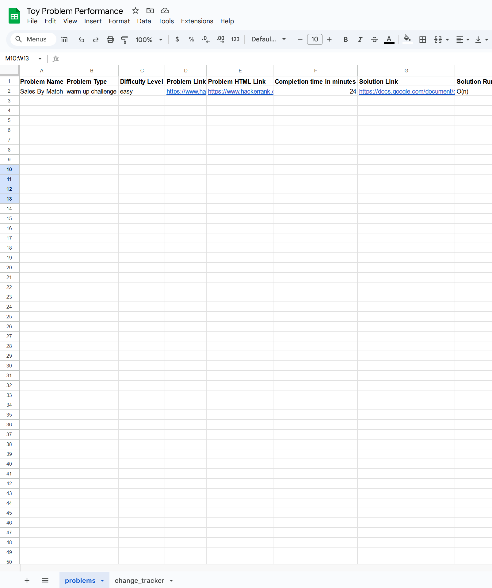

# Getting Started

Welcome to the **Interview Prep Analysis** project! This guide will help you set up the project from scratch, including setting up the PostgreSQL database, importing data from Google Sheets, and running the backend API.

## Prerequisites

Before you begin, ensure you have the following installed on your system:

- **WSL2 with Ubuntu**
- **Python 3.8+**
- **pip**
- **PostgreSQL**
- **Git**

## Installation Steps

### Clone the Repository

```bash
git clone https://github.com/yourusername/toy-problem-performance-analysis.git
cd interview-prep-analysis
```

### Set Up PostgreSQL

Follow these steps to install and configure PostgreSQL on your WSL2 Ubuntu instance.

a. **Update Your System**

Ensure your system packages are up-to-date:

```bash
sudo apt update
sudo apt upgrade - y
```

b. **Install PostgreSQL**

Install PostgreSQL and its additional components:
    
```bash
sudo apt install postgresql postgresql-contrib -y
```

c. **Start PostgreSQL Service**

```bash
sudo service postgresql start
```

d. **Access the PostgreSQL Shell**

Switch to the `postgres` user and open the PostgreSQL shell:

```bash
sudo -i -u postgres
psql
```

e. **Create a New Database and User**

In the PostgreSQL shell, create a new database and user:

```sql
   CREATE DATABSE problem_tracker;
   CREATE USER user_name WITH PASSWORD 'password_here';
   GRANT ALL PRIVILEGES ON DATABSE problem_tracker TO user_name;
```

f. **Exit the PostgreSQL Shell**

Exit the PostgreSQL shell and return to your regular user:

```bash
\q
exit
```
### Create the Database Schema

Define your database schema by using the provided SQL script.

a. **Run the SQL Script**

 Execute the SQL script to create the `problems` table in your PostgreSQL database:

 ```bash
psql -U user_name -d problem_tracker -h localhost -f create_problems_table.sql
 ```

### Intall Python Dependencies

It's recommended to use a virtual environment to manage your Python packages.

a. **Create and Activate Virutal Environment**

Create a virtual encironment and activate it.

```bash
python3 -m venv venv
```

b. **Update pip**
  Upgrate `pip` to the latest version:

```bash
pip install --upgrate pip
```

c. **Install Required Packages**

```bash
pip install -r requirements.txt
```

### Set Up Google Sheets Integration

Integrate Google Sheets with your project to import data.

a. **Create Services Account Credentials**

1.  Go to the Google [Cloud Console](https://cloud.google.com/cloud-console)
2. Create a new project or select an existing one.
3. Navigate to **APIs & Services > Credentials**
4. Click **Create Credentials > Service Account**
5. After creating the service account, click on it to open its details.
6. Navigate to the Keys tab and click **Add Key** > **Create new key**.
7. Follow the prompts to create a service account and download the `credentials.json` file in the project root.
8. Place the `credentials.json` file in the project root
9.  IMPORTANT! Be sure to add this credentials.json file to a .gitignore file in the root of the project, if you haven't done so already.

### Set Up Google Sheets and Apps Script

To enable automatic tracking of changes in your Google Sheets, you need to set up one spreadsheet named `Toy Problem Performance` and add the provided Google Apps Script to them.

a. **Create One Google Spreadsheet With Two Sheet Tabs**

1.  **Create the Spreadsheet**:
    - Go to [Google Sheets](https://sheets.google.com/) and create a new spreadsheet.
    - **Name the Spreadsheet:** `Toy Problem Performance`

2. **Create Two Worksheets (Tabs) within the Spreadsheet:**
    - **Problems Sheet:**
        - Rename the first sheet tab to `problems`.
    - **Change Tracker Sheet:**
        - Click the "+" button at the bottom to add a new sheet.
        - Rename the second sheet tab to `change_tracker`.

 

b. **Add the Google Apps Scripts**

You will add the provided scripts in `googleAppScript.js` to the **Problems Sheet** to track changes and update the **Change Tracker Sheet**

  1. **Access the Script Editor**:
    - Click on **Extensions** in the menu bar.
    - Select **Apps Script**
  2. **Copy the Script**: 
    - Open the `googleAppScript.js` file provided in this repository.
    - Copy the entire contents of the file into the Apps Script editor.
  3. **Save the Script:**
    - Click on the **Save** icon (or press `Ctrl + S`).

  4. **Authorize the Script:**
    - Click on **Run** > **Run function** > **onEdit**.
    - You will be prompted to authorize the script.
    - Follow the prompts to grant the necessary permissions.

  5. **Set Up Triggers:**
    - Click on the **Triggers** icon (clock symbol) on the left sidebar.
    - Click on **Add Trigger**.
    - Set up a trigger for the `onEdit` function:
        - **Choose which function to run:** `onEdit`
        - **Select event source:** `From spreadsheet`
        - **Select event type:** `On edit`

  6. **Verify the Setup:**
       - Make some changes in the **Problems Sheet**.
       - Open the **Change Tracker Sheet** to ensure that changes are being logged.

#### c. **Ensure The Sheet is Shared with the Service Account**
Share your Google Sheet with the service account email found in the `credentials.json` file to grant accesss.

### Data Ingestion: Importing Data from Google Sheets

**Important**. You must have an `.env` file in the project root with

```
DB_NAME=database_name_here
DB_USER=user_name_here
DB_PASSWORD=password_here
DB_HOST=localhost
DB_PORT=port_here
```

Use the provided script to import data from Google Sheets into PostgreSQL

a. **Run the Data Ingestion Script**

Execute the data ingestion script to import data from Google Sheets into PostgreSQL

```bash
python3 import_problems_from_sheets.py
```

This script imports problem-related data from Google Sheets to the PostgreSQL database.

### Run the FastAPI Server

Start the FastAPI backend to interact with the database.

a. **Run the Server**
    Launch the FastAPI server using `uvicorn`:

```bash
uvicorn main:app --reload
```

The server will be accessible at `http://127.0.0.1:8000`

### Additional Scripts and Files

a. **Schema SQL File**

- **File Name**: `create_problems_table.sql`
- **Description**: Contains the SQL commmands to create the `problems` table in PostgreSQL

b. **Data Ingestion Script**

- **File Name**: `import_problems_from_sheets.py`
- **Description**: Imports data from Google Sheets into the PostgreSQL `problems` table.

c. **Backend API**

- **File Name**: `main.py`
- **Description**: FastAPI backend to interact with the `problems` database.

## Potential Future Features

- Further progress can be made by updating the problem_tracker sheet, so that it has references to cells via row and column indices, so that you can just do batch upserts by 'coordinate' ids.
- The web crawler can be fleshed out more to grab predictable problem statements on sites like Leet code
- More thought needs to be given to the storage and persistence of solution code, problem statement, and problem html. Currently they're just links to instances of google docs, but they can later be added using more tables or something
- The front end doesn't exist. Jupyter notebooks needs to be integrated to interact with the live API for retrieving data from the database and performing analysis on problems.
- Much more.. timers for tracking completion of a successful submission, integration with all the other moving pieces etc.
